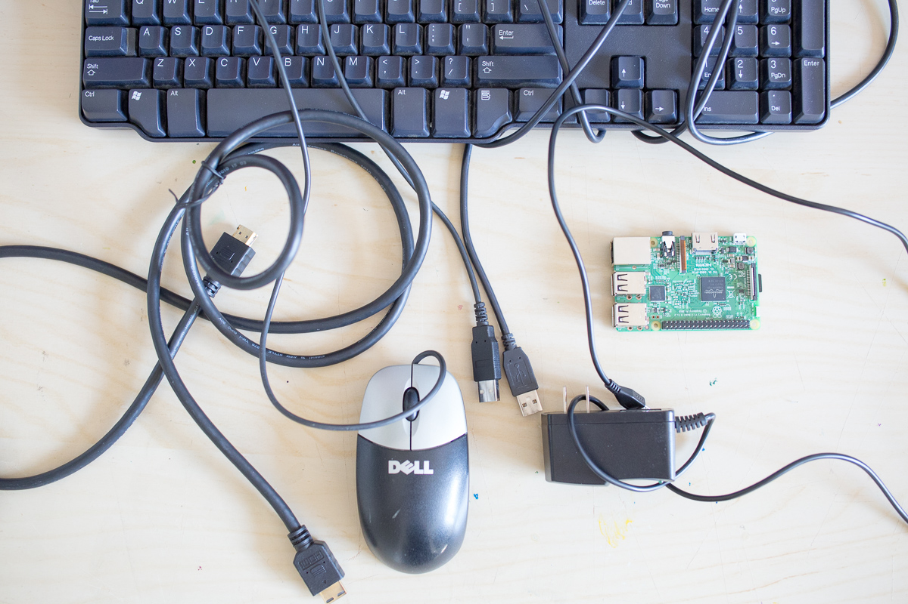
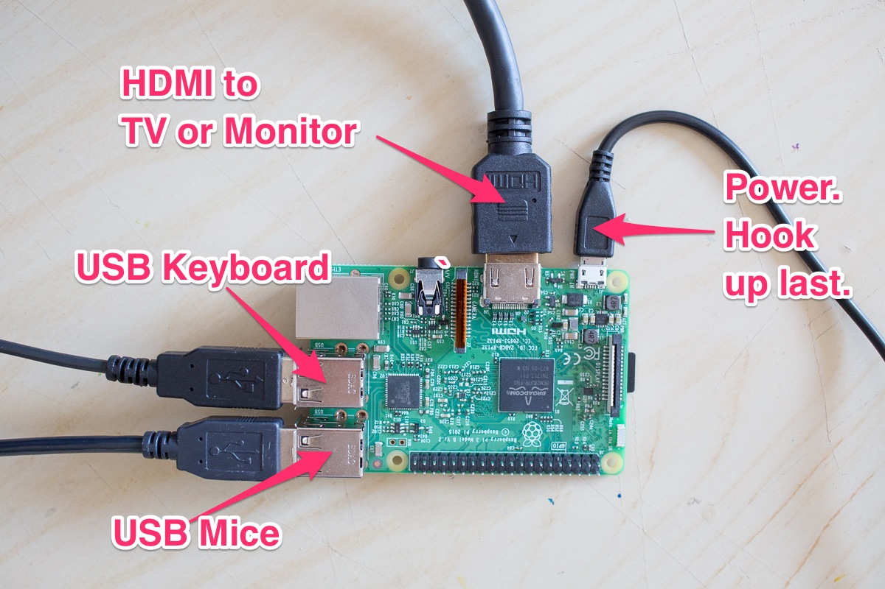

# How to Use Your Raspberry Pi Computer at Home

The Raspberry Pi is a tiny computer that fits in the palm of your hand. The [Raspberry Pi Foundation](https://www.raspberrypi.org/) created the Raspberry pi to teach kids how to code around the world.

Your Raspberry Pi Computer Kit Includes:
- Raspberry Pi Computer
- microSD card and card reader
- HDMI cable
- keyboardand mice

You will need to have your own TV or monitor to use with your Raspberry Pi.
## Step 1: Hook Up your Raspberry Pi

To use your Raspbrry Pi as a computer, you'll need to connect it to a keyboard, mice, and a monitor or TV. You need to connect them in a specific order so your Raspberry Pi can safely start.

First, make sure the MicroSD card is properly inserted in your Pi. Connect your HDMI cable to your Raspberry Pi and your monitor or your television, then connect your USB keyboard and mice.

Finally, once everything is connected, go ahead and plug in your power adapter. The Raspberry Pi does not have a power switch, so once you connect the power adapter, it’ll turn on all by itself.

## Step 2: Use Your Computer!

Use your pi as a computer!

## Step 3: Safely power off your Raspberry Pi Computer
## Additional Resources

- **Raspberry Pi Foundation** `https://www.raspberrypi.org/`

