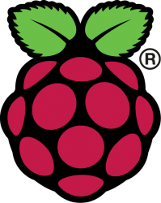

# Teleport

Programming with Python on the Raspberry Pi is a powerful and fun way to modify Minecraft games. With a few lines of code you can take control of the player and the every block in the world.

In this first worksheet you will use some basics of Python programming with Minecraft Pi. You’ll learn how to teleport the player to a new position on the map using variables in Python.

Before you begin you’ll need to create and save a python program file. You’ll also need to copy the set of Minecraft instructions that allow Minecraft to connect to Python. The next page includes instructions that show you how to do this.

## Setting Up

**Turn on the Raspberry Pi:**

    Turn on your Raspberry Pi. Wait until the computer asks for your username.

    Type in "pi" for the username and "raspberry" for the password.

1. **Open Minecraft:**

    To open Minecraft Pi click on the Raspberry Pi start menu on the upper left hand corner. Go to **Games** -> **Minecraft Pi**.

    Start a game and create a new world.

    > **Alert:** Press tab in Minecraft to release the mouse

2. **Open Thonny:**

    Thonny is used to run Python programs. Go to your start menu again -> **Programming** -> **Thonny (Simple Mode)**.

    In Thonny, click the "New" icon to start a blank file, then "Save" icon.

    Save your python file as "teleport" on your Desktop.


Type the Python code below into Thonny. Click the "Run" icon to run your code.

## Code
```
import mcpi.minecraft as minecraft
mc = minecraft.Minecraft.create()
x = 10
y = 50
z = 12
mc.playr.setPos(x,y,z)
```
### Import the API

Every Minecraft Pi program that you write in Python requires these two lines of code. The first line imports the commands that allow you to interact with a Minecraft game using Python. The second line creates a connection to the game.

```
import mcpi.minecraft as minecraft
mc = minecraft.Minecraft.create()
```

### Set the Variables

The player’s position in Minecraft is represented using coordinates. Here we have created three variables to represent the player’s position. A variable stores a value, in this case the variables `x`, `y` and `z` store the values `10`, `50` and `12` respectively.

```
x = 10
y = 50
z = 12
```

### Teleport the player

The last line teleports the player to a new position in the game. The `setPos()` function uses three number values, known as arguments, to change the player’s position. In this case we’re using the values of the `x`, `y` and `z` variables that we set earlier.

```
mc.player.setPos(x, y, z)
```

## What you’ve learned

### Variable

A variable stores a value. For example in our program we created three variables, `x`, `y` and `z`, which stored the values `10`, `50` and `12` respectively. You can change the values `10`, `50` and `12` to any number that you want. Variables can be reused. When we used `setPos()` on line 6 we were reusing the variables `x`, `y` and `z`.

### Integers

Integers are whole numbers, for example `10`, `347` and `59`. We use integers to set the values of variables when we want to use whole numbers. In this program we use the integers `10`, `50` and `12`.

### Function

A function is a reusable piece of code that performs a specific purpose. For example we used the pre-written function `setPos()` on line 6 to change the position of the player in the game world.

### Function arguments

Some functions need to be given data in order to work, this data is called an argument. For example on line 6 we gave the argument `x`, `y` and `z` to the `setPos()` in order to tell it where to teleport the player to.

### Minecraft Pi API

An **API** is a collection of pre-written functions that allow you to connect your Python code to another program. In this guide you have learned how to connect your Python programs to the Minecraft Pi API, which contains functions to control Minecraft Pi games.

## Your Turn!

Change your code and make it do different things.

-  What happens when you change the values of the `x`, `y` and `z` variables?
- What happens when you one of the values of `x`, `y` and `z` variables to a negative number?




Raspberry Pi and the Raspberry Pi logo are trademarks of the Raspberry Pi Foundation [http://www.raspberrypi.org](http://www.raspberrypi.org).

Minecraft is a registered trademark of Mojang.

These resources are copyright Craig Richardson and licensed under a [Creative Commons BY-NC-SA License](https://creativecommons.org/licenses/by-nc-sa/4.0/).
